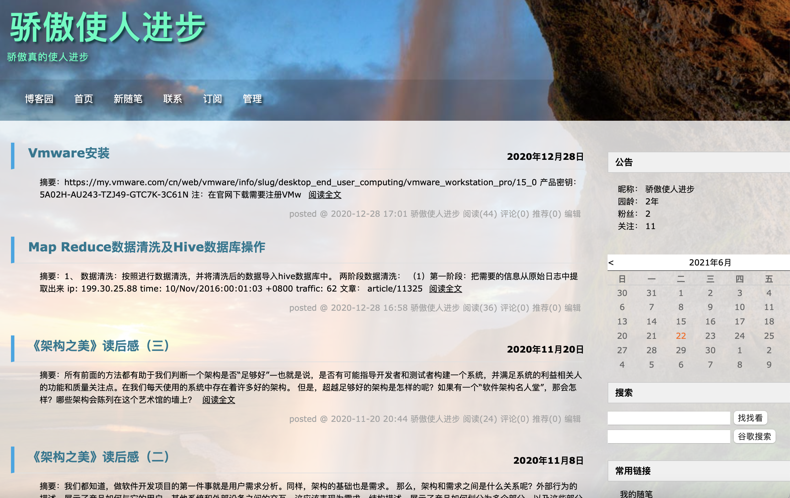

## Welcome to jiaoaoshirenjinbu's profile!!!

This is a university student here, and I'm glad to introduce myself.

<table border="0">
  <tr>
    <td width="75%">
      <h1>jiaoaoshirenjinbu</h1>
      
<b>- Bachelor</b>

      
<b>- Shijiazhuang Tiedao University  College of Information Sciences and Technology</b>

      
<b>- E-mail:1518786410@qq.com</b>

      
<b>- Address: No. 17,North 2nd Ring Road (East),Shijiazhuang City,Hebei Province,China</b>

    </td>
    <td width="25%">
      
    </td>
  </tr>
</table>

### Personal Inf
I was born in Jiangxi Province, where I spend my whore time living and studying there. In 2018, I graduated form NingDu Middle School of Jiangxi and got into my college now. In the college, I obtained not only the fundamental knowledge of my specialty, but also many friends in life. Generally speaking, I am a studious student, especially when doing the thing I am interested in, I will try my best to finish it no matter how difficult it is. When I was a sophomore, I thought that English would be significant to my further study, so I learned it very hard. I am a person with great perseverance, because I always think that the achievements the Great men attain are from their diligence and perseverance. 

### Biography
As a junior in Shijiazhuang Tiedao University, I learned IT technology for three years.In the first year in school, I joined lots of clubs such as Student Union of STD and new-media club named Yiqingnian. Next year,I participated in the National Contest of Maths Models and won the prize.Resently,I participated in the National Contest of English Capbility.

### My Blog
[cnblog](https://www.cnblogs.com/jiaoaoshirenjinbu/default.html?page=1)
<table border="0">
  <tr>
    <td width="100%">
      
    </td>
  </tr>
</table>

### Social Activities

- Yangzhou Jianzhen International Half Marathon, Outstanding Volunteer
- Responsible for the recruitment of volunteers in mainland China for The 2019 World Summer Special Olympic Games, Group Leader
- Volunteering for The 19th Sports Games of Jiangsu, as an assistant referees of the youth team of basketball games
- International Volunter Job in AIESEC in NJU, Mainland of China's Incoming Global Volunteer program Explore China7.0

